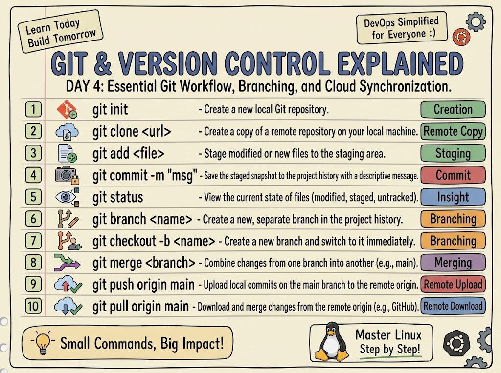

# Day 4: Git & Version Control

Today I learned and practiced advanced Git concepts including Branching, Merging, and fixing Push/Pull conflicts.

## Key Learnings & Commands Practiced:
* **Branching:** Created a new branch to work on experimental features without breaking the main code (`git checkout -b feature-update`).
* **Merging:** Successfully merged the new feature back into the main branch (`git merge feature-update`).
* **Troubleshooting:** Faced an issue with `unrelated histories` and `non-fast-forward` push rejections. Solved it by configuring the default merge method and using `git pull origin main --allow-unrelated-histories`.

Learning Git is essential for DevOps because it saves us when things go wrong during deployment!

### My Day 4 Practice Output:

